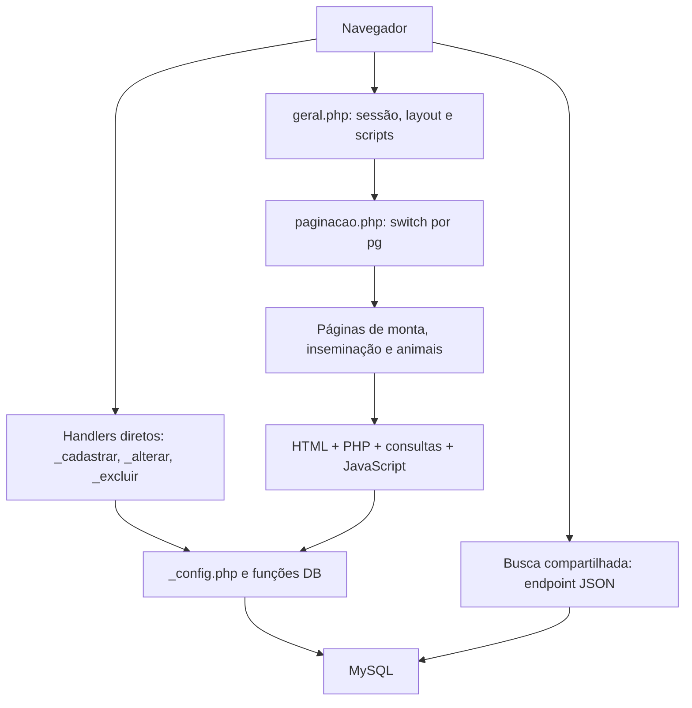

# Estudo de design e arquitetura — monta, inseminação e cadastro de animais

Data: 29/09/2026.

## Escopo e método

Leitura estática do estado atual do workspace: listagens, criação e detalhe de lotes de monta e inseminação, cadastro de animais (rebanho, compra, terceiros e nascimento), handlers relacionados, componentes compartilhados, navegação e acesso ao banco. Foram consideradas as alterações locais já presentes, sem modificá-las.

Não houve execução de operações no banco, navegação autenticada ou avaliação visual em navegador. Aspectos de layout abaixo foram identificados no HTML/CSS; responsividade, contraste, foco e comportamento real ainda precisam de validação visual. Restrições e índices do banco não foram auditados. Este documento registra o diagnóstico e propostas; não implementa as mudanças.

## 1. Diagnóstico geral

O sistema é um monólito PHP procedural com páginas renderizadas no servidor. A identidade visual é consistente em sua base, mas a evolução dos componentes e dos contratos de dados é parcial. Há trechos recentes com validação explícita, escape de saída, componentes compartilhados e consultas parametrizadas convivendo com handlers antigos que interpolam entradas e resolvem animais pelo nome.

A melhor referência visual para continuidade é o conjunto das listagens de monta e inseminação. Para busca de animais e confirmação de exclusão, os componentes compartilhados já constituem uma base reutilizável. Nenhum dos módulos deve ser copiado integralmente como modelo de backend: mesmo inseminação possui diferenças relevantes entre criação, edição e exclusão.

## 2. Padrão visual e de interação observado

| Elemento | Padrão existente | Direção para continuidade |
| --- | --- | --- |
| Estrutura da página | AdminLTE 2, Bootstrap 3, menu lateral, `content-header`, título e breadcrumb | Preservar a estrutura durante a evolução incremental |
| Agrupamento | Caixas `.box`/`.box-body`, frequentemente sem borda superior | Extrair variações recorrentes para classes próprias |
| Formulários | `.form-group`, `.form-control`, normalmente `col-sm-6 col-md-4`; linhas flexíveis alinhadas pela base | Reutilizar a grade e padronizar espaçamentos e ações |
| Cores de ação | Verde para cadastro, azul para pesquisa/PDF, cinza para limpar, vermelho para exclusão | Manter a semântica com rótulos claros |
| Listagens | Filtros separados dos resultados, tabela com bordas e linhas alternadas, ações à direita | Usar como referência para novas listagens |
| Paginação | 10, 20, 50 ou 100 registros; contagem e manutenção dos filtros | Compartilhar a apresentação e mover a paginação para o banco |
| Datas | Máscara e calendário globais em `geral.php`, exibição em dia/mês/ano | Unificar também a validação no servidor |
| Busca de animais | Componente com nome, metadados, ID e origem; ainda coexistem autocompletes antigos | Adotar o componente em criação, edição e filtros |
| Feedback | Bordas vermelhas/verdes, `alert()` e `history.back()`; mensagens locais de vazio/erro | Mensagens junto aos campos, foco no primeiro erro e preservação dos valores |
| Exclusão | API compartilhada `confirmarExclusao()` já usada nas listagens e nos detalhes analisados | Consolidar uso e remover implementações antigas após verificar referências |
| Ultrassom | Interruptor com texto e ícone para positivo, negativo e não informado | Rever representação de três estados e possibilidade de limpar informação |

Os arquivos `dist/css/busca-animais.css`, `dist/js/busca-animais.js` e os equivalentes de confirmação já separam apresentação e comportamento. A busca possui atraso de 250 ms, tratamento de falhas e navegação por setas/Enter/Escape. A confirmação possui gerenciamento de foco e textos inseridos com `textContent`.

Ainda há repetição extensa de CSS inline. Estilos próprios também estão em `bower_components/bootstrap/dist/css/principal.css`, misturando código da aplicação com a pasta de dependências. Uma evolução deve concentrar estilos da aplicação em arquivos próprios, sem alterar a identidade visual incidentalmente.

Pontos de acessibilidade a validar: células clicáveis sem links, `label for` desconectado do campo em formulários antigos, erro indicado apenas por cor e a diferença entre o interruptor binário e os três estados do ultrassom. As grades e `.table-responsive` oferecem uma base responsiva, mas não demonstram, por si só, bom funcionamento em telas pequenas.

## 3. Fluxos e diferenças de domínio

### Monta natural

Listagem → cadastro de lote → detalhe/editável → adicionar fêmeas → registrar ultrassom → registrar nascimento → cadastro da cria.

O lote possui período inicial/final, macho, raça e notificação PO/PC. Na criação, o servidor rejeita datas invertidas e intervalo superior a 90 dias. O cadastro do macho ainda depende de nome. A adição de fêmeas já recebe ID e origem pelo componente compartilhado.

### Inseminação artificial

Segue a mesma estrutura de lote e controle de fêmeas. Usa uma data e acrescenta tipo de sêmen: a fresco, congelado ou refrigerado. A criação resolve macho por ID/origem, com fallback por nome; a edição ainda usa o autocomplete e a resolução antigos.

### Cadastro de animais

| Modalidade | Comportamento observado |
| --- | --- |
| Rebanho | Animal existente, identificação, datas e genealogia; valida datas no backend e atualiza indicadores de matriz/reprodutor |
| Compra | Estrutura semelhante à de rebanho, com data de entrada e preço de compra; também atualiza indicadores |
| Terceiros | Cadastro em tabela própria; genealogia armazenada como texto no handler analisado |
| Nascimento | Busca matriz/data, apresenta lotes e encaminha ao formulário da cria; também pode ser iniciado diretamente do detalhe do lote |

`animal/cadastrar/cadastrar.php` reúne essas modalidades em aproximadamente 1.100 linhas. O nascimento cruza monta, inseminação e transferência de embriões; essa dependência precisa ser preservada ao separar o arquivo.

Há uma divergência entre texto e implementação: a dica de Compra promete gerar registro financeiro, mas `_compra.php` grava `preco_de_compra` e indicadores, sem lançamento financeiro explícito nesse handler. Triggers ou comportamento externo não foram verificados; a promessa precisa ser confrontada com o fluxo completo antes de alterar a interface.

## 4. Arquitetura atual

- **Roteamento:** `geral.php?pg=...`, com seleção explícita em `paginacao.php`. Este último é roteador de páginas, apesar do nome.
- **Apresentação:** arquivos PHP incluem consultas e regras junto ao markup; dependem de variáveis do escopo do layout, como `$user`.
- **Operações:** scripts separados recebem GET/POST e redirecionam com `Location` ou meta refresh. Não há uma camada uniforme de casos de uso nos fluxos analisados.
- **Persistência:** helpers procedurais `DBRead`, `DBCreate`, `DBUpdate`, `DBDelete`. `DBExecute` abre e fecha conexão por operação; `DBEscape` também abre conexão. Isso amplia custo de consultas repetidas e impede transações envolvendo várias chamadas pela API atual.
- **Exceção positiva:** `animal/_buscar_animais.php` usa consultas preparadas e resposta JSON com contrato explícito.
- **Relatórios:** `_imprimir.php` carrega dados e delega desenho do PDF a classes específicas. A separação é aproveitável, embora ainda existam consultas por animal.

### Identidade e relacionamentos

| Conceito | Monta | Inseminação |
| --- | --- | --- |
| Lote | `monta` | `inseminacao` |
| Macho do lote | `id_animal` + `terceiro` | `id_macho` + `terceiro` |
| Controle de fêmea | `monta_controle` | `inseminacao_controle` |
| Referência ao lote no controle | `id_monta` | `id_lote` |
| Fêmea do controle | `id_animal` + `terceiro` | `id_femea` + `terceiro` |
| Resumo em `lotes_reproducao` | `tipo = 0` | `tipo = 1` |
| Tipo recebido pelo cadastro de nascimento | `tipo = 1` | `tipo = 2` |

ID de animal só é inequívoco junto da origem. ID de controle e ID de lote são conceitos distintos, mas algumas URLs usam `id_lote` para transportar o ID do controle. Também existem códigos de tipo diferentes entre resumo e nascimento. Esses contratos devem ser nomeados e centralizados antes de abstrair os módulos.

## 5. Achados prioritários com evidência

| Prioridade | Evidência no código | Consequência e encaminhamento |
| --- | --- | --- |
| Alta | `_config.php:11` define `$banco = 'buria'`, embora valide sessão e o README descreva seleção por usuário | O banco acessado não acompanha `$_SESSION['banco']`. Confirmar finalidade dessa configuração local antes de continuar evolução com múltiplas fazendas |
| Alta | `reproducao/inseminacao/_excluir_femea.php:7` exclui por `id_femea` e lote, sem origem | Se rebanho e terceiros tiverem o mesmo ID no lote, ambos os controles podem ser removidos. Usar ID do controle validado contra o lote, como o fluxo atual de monta |
| Alta | `mysqli/_database.php`, handlers `_alterar.php` dos dois módulos e consultas de duplicidade em cadastros de animais | SQL interpolado e `DBUpdate` sem escape automático dos valores. Migrar operações tocadas para parâmetros vinculados e validar entradas |
| Alta | `_excluir_lote.php`, `_excluir_femea.php`, `_cadastrar_ultrassom.php` | Alterações são acionadas por GET; não foi encontrada verificação de token CSRF nos arquivos examinados. Usar POST, proteção CSRF e validação de vínculo no servidor |
| Alta | `_cadastrar.php` dos lotes e `_nascimento.php` escrevem em várias tabelas através dos helpers | Falha intermediária pode deixar dados e indicadores divergentes. Introduzir conexão compartilhada e transação por operação de negócio |
| Média | `reproducao/monta/_cadastrar.php` versus `_alterar.php` | Criar valida ordem das datas; editar só rejeita intervalo maior que 90 dias. Compartilhar a validação entre ambas as operações |
| Média | Cadastro versus edição de inseminação; filtros de ambas as listagens | O componente envia identidade, mas vários consumidores ainda resolvem por nome. Homônimos podem produzir vínculos/filtros inconsistentes |
| Média | `lista_monta.php` e `lista_inseminacao.php` | Carregam todos os lotes, consultam macho por lote e só depois aplicam `array_slice`; há consultas adicionais para o seletor. Usar filtragem, contagem e paginação SQL |
| Média | `animal/cadastrar/cadastrar.php`, `_compra.php`, `_rebanho.php`, `_nascimento.php` | Formulários, resolução de parentes e indicadores duplicados. Extrair responsabilidades gradualmente, preservando diferenças de cada modalidade |
| Média | `geral.php:527` | Condicional usa `$pg = 'relatorio_mortes'` e `$pg = 'cadastrar_exposicao'` em vez de comparação. Pode alterar `$pg` e carregar recursos fora das páginas pretendidas; não se trata do switch de roteamento já executado |
| Média | Monta/inseminação exibem `ultrassom` 0/1/2 com `role="switch"` | A ação alterna positivo/negativo, sem caminho de retorno a não informado. Definir representação e regra antes de generalizar o componente |

A confirmação visual de exclusão não resolve os problemas do endpoint. O mesmo vale para campos obrigatórios no navegador: a regra precisa existir também no servidor.

A documentação de confirmação (`includes/confirmacao_exclusao.md`) não lista todas as telas já migradas. O documento de busca também descreve menos opções do que o componente atual. Atualizar os contratos documentados junto das próximas mudanças evita novas implementações paralelas.

## 6. Direção proposta para a evolução

Preservar PHP renderizado no servidor, rotas existentes e identidade visual como ponto de partida. Separar responsabilidades por pequenas entregas:

1. **Entrada HTTP:** validar método, sessão, token e parâmetros; converter entradas em dados normalizados.
2. **Serviços de aplicação:** criar/editar lote, vincular/remover fêmea e registrar nascimento, com validações compartilhadas e transação.
3. **Acesso a dados:** consultas parametrizadas, conexão reutilizável e métodos explícitos por entidade.
4. **Apresentação:** templates com dados preparados e componentes para campos, ações, tabelas, paginação e mensagens.

Contratos recomendados:

- Animal selecionado: `{id, origem}`; nome permanece rótulo de exibição. Validar existência, origem e sexo no servidor.
- Separar `id_lote`, `id_controle` e `id_animal`; manter adaptação temporária das URLs antigas quando necessário.
- Datas: apresentação em `dd/mm/aaaa`, persistência em `YYYY-MM-DD` e parser compartilhado com validação estrita.
- Tipos e estados: constantes ou mapas explícitos para evitar confusão entre códigos de reprodução e estados de controle.
- Criação e edição devem chamar as mesmas regras; retorno de erro deve preservar os valores e indicar o campo.
- Definir uma única rotina de atualização dos indicadores derivados, executada na mesma transação da alteração principal.

Monta e inseminação podem compartilhar componentes de listagem, formulário básico, seleção de fêmea e controle reprodutivo. Período de monta, tipo de sêmen e regras próprias devem continuar explícitos. Evitar um formulário genérico com muitas condições espalhadas.

## 7. Sequência sugerida de entregas

1. **Confiabilidade dos contratos:** esclarecer banco/fazenda ativo; corrigir identificação na remoção de fêmea; alinhar regras de criação/edição; preparar operações parametrizadas e transacionais.
2. **Uniformização dos lotes:** migrar macho de monta e edição de inseminação para a busca compartilhada, consumir ID/origem nos filtros e unificar feedback.
3. **Organização do cadastro de animais:** separar os quatro formulários e extrair resolução de parentes/validação; manter o fluxo de nascimento integrado aos lotes.
4. **Componentes visuais:** consolidar campos, ações, tabelas e paginação; reduzir estilos inline e código legado sem uso.
5. **Desempenho e validação visual:** paginação SQL, redução das consultas por linha e revisão de teclado/telas pequenas.

Os itens desta sequência são propostas para a próxima etapa, não alterações realizadas neste estudo.

## 8. Critérios para validar as próximas mudanças

- Criar e editar monta com datas iguais, invertidas e intervalo acima de 90 dias.
- Criar e editar inseminação preservando data, sêmen, notificação e origem do macho.
- Selecionar animais homônimos em origens distintas; testar também IDs iguais entre tabelas.
- Adicionar e excluir uma fêmea sem afetar outra origem ou outro lote; rejeitar repetição do vínculo.
- Conferir positivos, negativos, não informado e indicadores após cada alteração.
- Registrar partos simples, duplos e triplos e conferir vínculo das crias, genealogia e contadores; avaliar reenvio do formulário.
- Verificar falha intermediária com rollback integral nas operações de múltiplas tabelas.
- Exercitar rebanho, compra e terceiros, inclusive nomes com apóstrofo e datas inválidas.
- Conferir filtros e paginação com volume representativo; comparar tela e PDF.
- Validar sessão ausente, IDs inválidos, POST sem token e vínculo fora do lote em ambiente de teste.
- Conferir layout em celular, tablet e desktop e concluir os fluxos pelo teclado.

## 9. Arquivos de referência

- Estrutura: `geral.php`, `paginacao.php`, `_config.php`.
- Persistência: `mysqli/_database.php`, `mysqli/_conexao.php`.
- Busca: `includes/busca_animais.php`, `animal/_buscar_animais.php`, `dist/js/busca-animais.js`, `dist/css/busca-animais.css`.
- Confirmação: `includes/confirmacao_exclusao.php`, `dist/js/confirmacao-exclusao.js`, `dist/css/confirmacao-exclusao.css`.
- Status: `dist/css/controle-status.css`.
- Monta: `reproducao/monta/lista_monta.php`, `cadastrar_monta.php`, `monta.php` e handlers do diretório.
- Inseminação: `reproducao/inseminacao/lista_inseminacao.php`, `cadastrar_inseminacao.php`, `inseminacao.php` e handlers do diretório.
- Animais: `animal/cadastrar/cadastrar.php`, `cadastrar_nascimento.php`, `_rebanho.php`, `_compra.php`, `_terceiros.php`, `_nascimento.php`.
